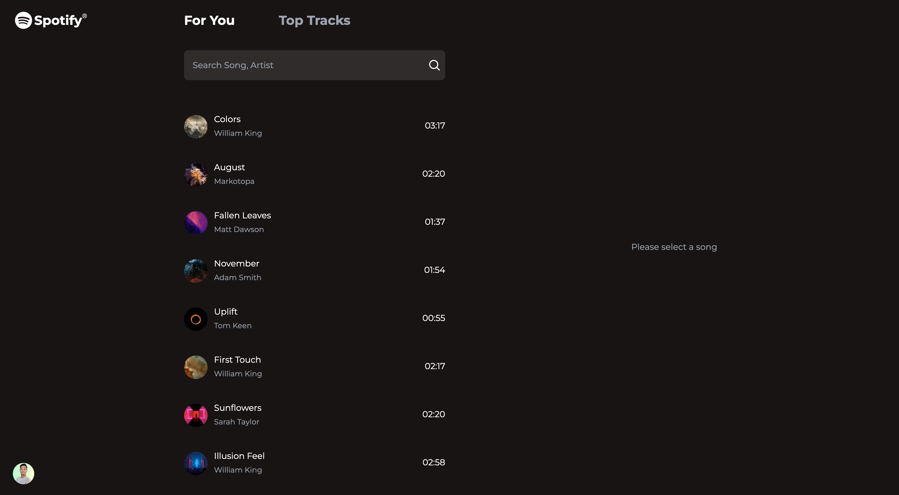
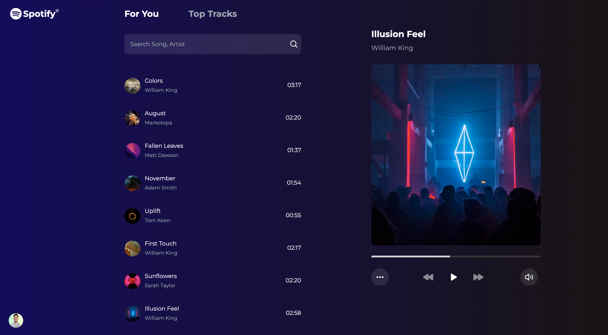
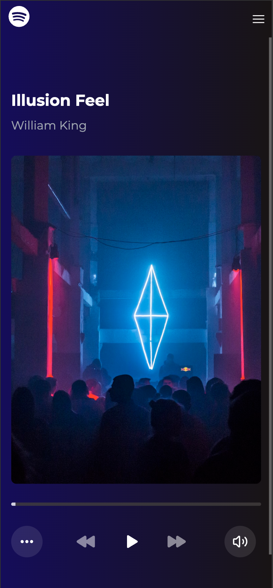
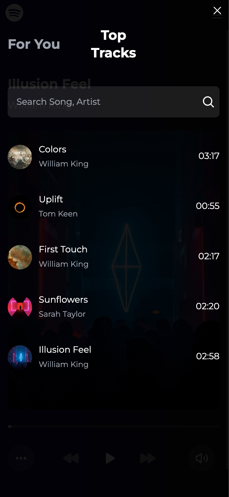

# Samespace frontend hiring Task

## Usage

1. **Install dependencies:**
    ```sh
    npm install
    ```

1. **Run the project:**
    ```sh
    npm run dev
    ```

2. Open your browser and navigate to `http://localhost:5173`

## Live Demo

You can view the live demo [here](https://samespace-frontend-assignment-beta.vercel.app).

## Screenshots




